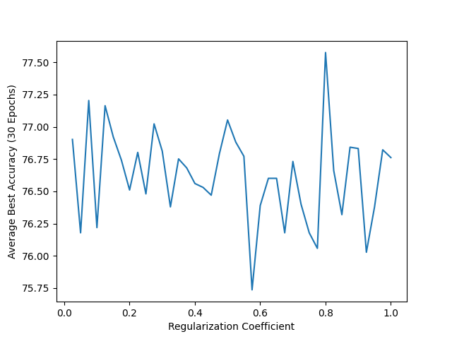

# <u>Self-Optimal Transport Usage in Visual Transformers</u>
We were assigned with the task of integrating the SOT algorithm in the attention mechanism in a transformer NN.  
In order to evaluate the differences we chose a [Compact Transformer](https://account.jetbrains.com/github/oauth/intellij/authorize?code_challenge=3y%2Bj7z1INw%2FWRw6ILR6YFi1QXCV5R7GcsQ1JLTD2Ygk%3D&callback_url=http%3A%2F%2F127.0.0.1%3A63342%2Fapi%2Fgithub%2Foauth%2Fauthorization_code) (namely, Convolutional Compact Transformer/CCT with 2 heads) with short training time.   
We have used Daniel Shalam's & Simon Korman's [Self-Optimal Transport](https://github.com/DanielShalam/SOT) code and have modified it a bit to support input of 2 tensors.

## Testing SOT usage
We tried various ways to combine the SOT with the Attention mechanism,  
more briefly, we have tried 3 different ways to use the SOT:


### <u>Before changing the attention</u>
The original way the attention was calculated was as follows:

```python
attn = (q @ k.transpose(-2, -1))
```

Where Q and K are two of the three vectors in the attention mechanism.

<b>This achieved 78.14% accuracy at best</b>

***
### <u>After changing the attention</u>
The various ways we later tried to use were as follows:

<b>It's worth to mention that the entropy regularization coefficient for  
the following results was 0.1 (default)</b>.  
More about the Softmax part later.

* `Attention = SOT(Q)`
<b>76.65%</b>
* `Attention = SOT(Q)(Without Softmax)`
<b>74.96%</b>
* `Attention = SOT(Q, K)`
<b>75.14%</b>
* `Attention = SOT(Q, K)(Without Softmax)`
<b>76.88%</b>
* `Attention = SOT(Q, K.T)`
<b>76.76%</b>

### <u>Testing SOT With Different Regularization Coefficients</u>
We have ran a test to see whether different regularization coefficients achieved  
worse/better results and whether we can beat our previous results.

The test ran 5 times for each coefficient on the [0.025, 1] interval with a step size of 0.025 using the SOT(Q,K) variant:

The graph represents the average best accuracy of the model for each coefficient.

* We can definitely see that the results are very close to the original attention mechanism results, around 77-78%.
***

## Visual Results

We have selected a random tensor inside the input in a random batch and wanted  
to see the attention inside it visually so we have made a heatmap for the attention weights  
and also have visualized the distribution of the attention weights.

### <u> Histograms && Heatmaps of Attention Weights </u>
It's important to mention that for the first and third histograms the x-axis was fixed in contrast to the second and fourth one
where the x coordinates were so small we had to give it automatic scaling in order to understand what is going on.

- It's worth to mention that the softmax graphs were very sensitive and hard to plot so we have applied a log function on the values to present a better plot (this applies to second and fourth graphs)


For the same problem from the histogram section, the heatmap for the second and fourth ones was weird but for
a good reason, since we have a big cluster of points in the 0.0175 area and a small cluster in the 0 area 
the difference between the two should be very clear, this is why we see a lot of black points (0) and a big area of
yellow-ish points that represnt the cluster in the 0.0175 area.

#### <u> SoftMaxing the SOTed Tensors </u>
In previous section we showed 2 versions of the experiment: with and without performing SoftMax on the result.
Before SoftMax the tensor has a typical look of SOTed features - symmetric and with dense diagonal.    
Even though SOT outputs positive values, since every row counts to 2, SoftMax is still needed. Nevertheless, we experimented without SoftMax and the results were
better in one case and worse in the other.
***

## How to Run

```bash
  python main.py --ot 0.1 --model cct_2 --conv-size 3 --conv-layers 2 --print-freq -1 --epochs 30 --workers 1 cifar10/
```

You may change the arguments to your liking, the provided command is what we used in our experiments when using the default regularization coefficient
(the ot argument)


