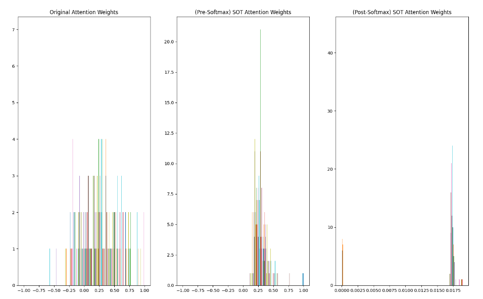
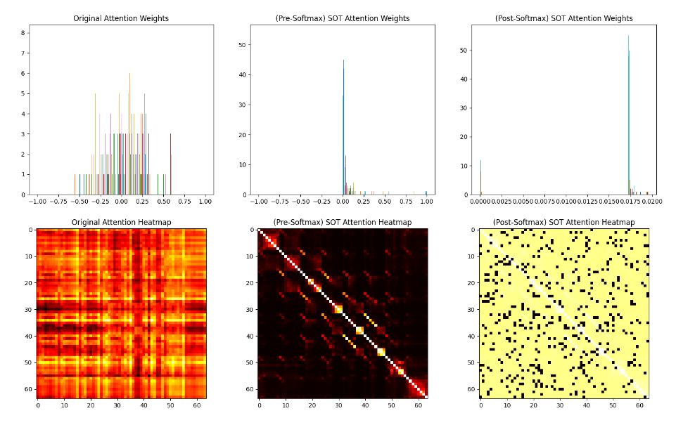

# <u>Self-Optimal Transport Usage in Visual Transformers</u>
We were assigned with the task of integrating the SOT algorithm in the attention mechanism in a transformer NN.  
In order to evaluate the differences we chose a [Compact Transformer](https://account.jetbrains.com/github/oauth/intellij/authorize?code_challenge=3y%2Bj7z1INw%2FWRw6ILR6YFi1QXCV5R7GcsQ1JLTD2Ygk%3D&callback_url=http%3A%2F%2F127.0.0.1%3A63342%2Fapi%2Fgithub%2Foauth%2Fauthorization_code) (namely, Convolutional Compact Transformer/CCT with 2 heads) with short training time.   
We have used Daniel Shalam's & Simon Korman's [Self-Optimal Transport](https://github.com/DanielShalam/SOT) code and have modified it a bit to support input of 2 tensors.

## Testing SOT usage
We tried various ways to combine the SOT with the Attention mechanism,  
more briefly, we have tried 3 different ways to use the SOT:


### <u>Before changing the attention</u>
The original way the attention was calculated was as follows:

```python
attn = (q @ k.transpose(-2, -1))
```

Where Q and K are two of the three vectors in the attention mechanism.

<b>This achieved 78.14% accuracy at best</b>

***
### <u>After changing the attention</u>
The various ways we later tried to use were as follows:

<b>It's worth to mention that the entropy regularization coefficient for  
the following results was 0.1 (default)</b>.  
More about the Softmax part later.

* `Attention = SOT(Q)`
<b>76.65%</b>
* `Attention = SOT(Q)(Without Softmax)`
<b>74.96%</b>
* `Attention = SOT(Q, K)`
<b>75.14%</b>
* `Attention = SOT(Q, K)(Without Softmax)`
<b>76.88%</b>
* `Attention = SOT(Q, K.T)`
<b>76.76%</b>

### <u>Testing SOT With Different Regularization Coefficients</u>
We have ran a test to see whether different regularization coefficients achieved  
worse/better results and whether we can beat our previous results.

The test ran for a couple of hours on the [0.025, 1] interval with a step size of 0.025 using the SOT(Q,K) variant:
```
best top-1: 76.52, final top-1: 76.52, Entropy Coefficient: 0.025
best top-1: 75.80, final top-1: 75.72, Entropy Coefficient: 0.05
best top-1: 76.82, final top-1: 76.78, Entropy Coefficient: 0.075
best top-1: 75.84, final top-1: 75.69, Entropy Coefficient: 0.1
best top-1: 76.78, final top-1: 76.61, Entropy Coefficient: 0.125
best top-1: 76.54, final top-1: 76.54, Entropy Coefficient: 0.15
best top-1: 76.36, final top-1: 76.36, Entropy Coefficient: 0.175
best top-1: 76.13, final top-1: 76.13, Entropy Coefficient: 0.2
best top-1: 76.42, final top-1: 76.42, Entropy Coefficient: 0.225
best top-1: 76.10, final top-1: 76.10, Entropy Coefficient: 0.25
best top-1: 76.64, final top-1: 76.51, Entropy Coefficient: 0.275
best top-1: 76.43, final top-1: 76.21, Entropy Coefficient: 0.3
best top-1: 76.00, final top-1: 76.00, Entropy Coefficient: 0.325
best top-1: 76.37, final top-1: 76.37, Entropy Coefficient: 0.35
best top-1: 76.30, final top-1: 76.20, Entropy Coefficient: 0.375
best top-1: 76.18, final top-1: 76.18, Entropy Coefficient: 0.4
best top-1: 76.15, final top-1: 76.15, Entropy Coefficient: 0.425
best top-1: 76.09, final top-1: 76.04, Entropy Coefficient: 0.45
best top-1: 76.41, final top-1: 76.40, Entropy Coefficient: 0.475
best top-1: 76.67, final top-1: 76.62, Entropy Coefficient: 0.5
best top-1: 76.50, final top-1: 76.46, Entropy Coefficient: 0.525
best top-1: 76.39, final top-1: 76.39, Entropy Coefficient: 0.55
best top-1: 75.36, final top-1: 75.09, Entropy Coefficient: 0.575
best top-1: 76.01, final top-1: 75.89, Entropy Coefficient: 0.6
best top-1: 76.22, final top-1: 75.99, Entropy Coefficient: 0.625
best top-1: 76.22, final top-1: 76.18, Entropy Coefficient: 0.65
best top-1: 75.80, final top-1: 75.70, Entropy Coefficient: 0.675
best top-1: 76.35, final top-1: 76.35, Entropy Coefficient: 0.7
best top-1: 76.02, final top-1: 75.93, Entropy Coefficient: 0.725
best top-1: 75.80, final top-1: 75.80, Entropy Coefficient: 0.75
best top-1: 75.68, final top-1: 75.68, Entropy Coefficient: 0.775
best top-1: 77.19, final top-1: 77.19, Entropy Coefficient: 0.8
best top-1: 76.28, final top-1: 75.95, Entropy Coefficient: 0.825
best top-1: 75.94, final top-1: 75.92, Entropy Coefficient: 0.85
best top-1: 76.46, final top-1: 76.46, Entropy Coefficient: 0.875
best top-1: 76.45, final top-1: 76.45, Entropy Coefficient: 0.9
best top-1: 75.65, final top-1: 75.65, Entropy Coefficient: 0.925
best top-1: 76.00, final top-1: 75.72, Entropy Coefficient: 0.95
best top-1: 76.44, final top-1: 76.39, Entropy Coefficient: 0.975
best top-1: 76.38, final top-1: 76.34, Entropy Coefficient: 1.0
```
* Surprisingly, the results were almost always worse, where quite a few did not break the 76% barrier.
* Although one test did break the 77% barrier with a Coefficient of 0.8. <b>77.19%</b>
***

## Visual Results

We have selected a random tensor inside the input in a random batch and wanted  
to see the attention inside it visually so we have made a heatmap for the attention weights  
and also have visualized the distribution of the attention weights.

### <u> Histogram of Attention Weights </u>


It's important to mention that for the first 2 histograms the x-axis was fixed in contrast to the third one
where the x coordinates were so small we had to give it automatic scaling in order  
to understand what is going on.


### <u> Heatmap of Attention Weights </u>



For the same problem from the histogram section, the heatmap for the third one was weird but for  
a good reason, since we have a big cluster of points in the 0.0175 area and a small cluster in the 0 area 
the difference between the two should be very clear, this is why we see a lot of black points (0) and a big area of
yellow-ish points that represnt the cluster in the 0.0175 area.

#### <u> SoftMaxing the SOTed Tensors </u>
In previous section we showed 2 versions of the experiment: with and without performing SoftMax on the result.
Before SoftMax the tensor has a typical look of SOTed features - symmetric and with dense diagonal.    
Even though SOT outputs positive values, since every row counts to 2, SoftMax is still needed. Nevertheless, we experimented without SoftMax and the results were
better in one case and worse in the other.


